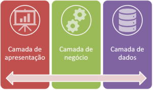
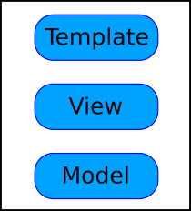
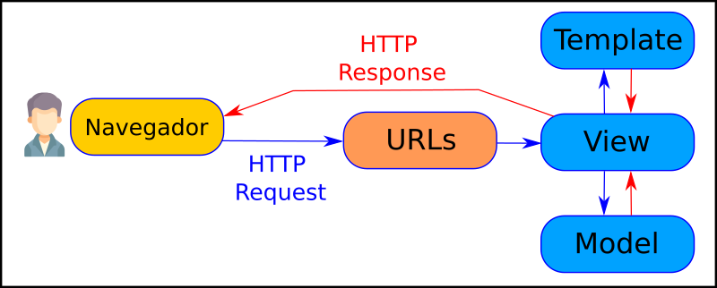
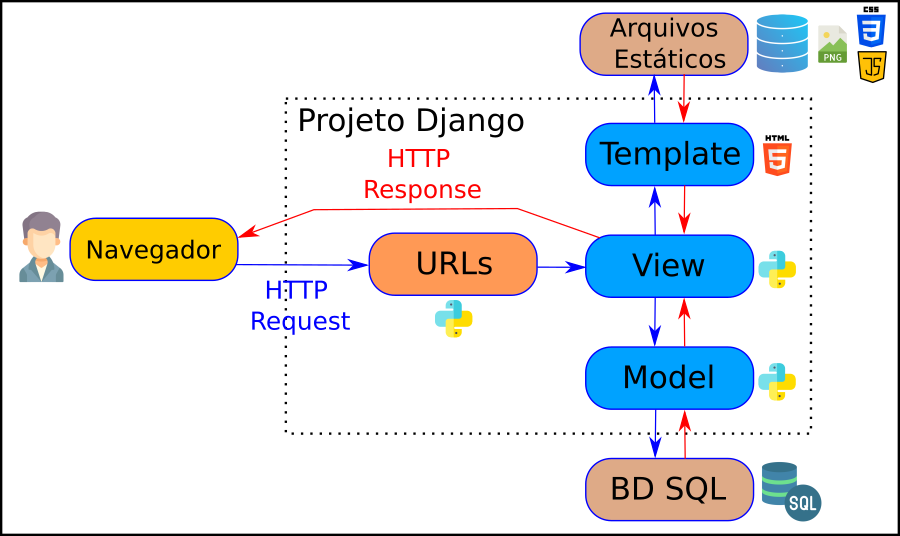
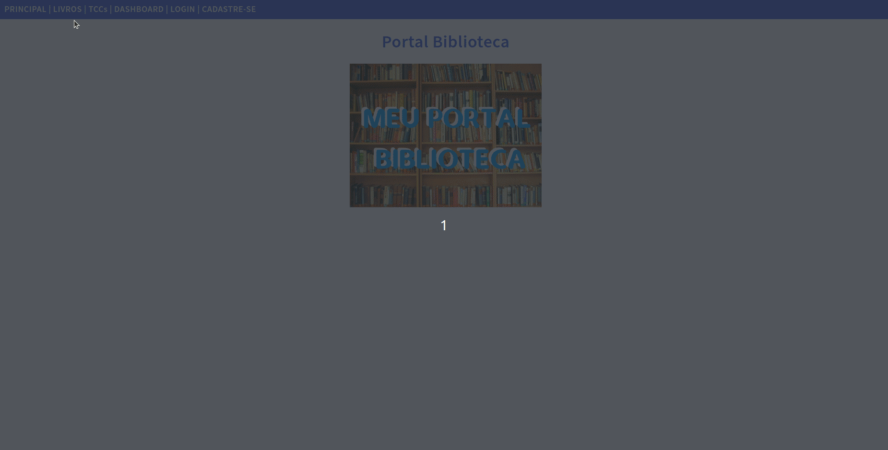

# Aula Djando 02 - Sistema para Portal Biblioteca

<p align="center">
  <a href="#">
    
  </a>
  <a href="#">
    
  </a>
  <a href="#">
    
  </a>
</p>

Aula Djando 02. Projeto utilizando o Django para ser desenvolvido na Aula de GAC116 - Programação Web.

O objetivo desse projeto é criar um sistema para gestão de biblioteca.

Este tutorial foi elaborado baseado no tutorial disponível no [curso de django da w3schools](https://www.w3schools.com/django/index.php).

## Linguagens Utilizadas

* Python - [link](https://www.python.org/)
* JavaScript - [link](https://www.javascript.com/)
* HTML - [link](https://html.com/)
* CSS - [link](https://www.w3schools.com/css/)

## Framework Utilizados

* Django - [link](https://www.djangoproject.com/)
* Bootstrap - [link](https://getbootstrap.com/)
* Chart.js - [link](https://www.chartjs.org/)

## Ferramentas Utilizadas

* Visual Studio Code - [link](https://code.visualstudio.com/)
* SQLite Online - [link](https://sqliteonline.com/)
* DB Browser for SQLite - [link](https://sqlitebrowser.org/)
* Pip - [link](https://pypi.org/project/pip/)
* VirtualEnv - [link](https://virtualenv.pypa.io/)

## Arquitetura Web

### Arquitetura Geral das Aplicação Web



Fonte: [https://blog.grancursosonline.com.br/arquitetura-em-tres-camadas-para-aplicacoes-web/](https://blog.grancursosonline.com.br/arquitetura-em-tres-camadas-para-aplicacoes-web/)

## Arquitetura Django

### Arquitetura MVT - Geral



### Arquitetura MVT - Requisição



### Arquitetura MVT - Detalhes



## Objetivo da Aula



## Comandos utilizados na criação deste projeto

### Clonando o Repositório

Inicialmente, clone o repositório da seguinte forma:

```bash
git clone https://github.com/ufla-prog-web/aula-django-02.git
```

### Baixando o Repositório

Caso deseje ao invês de clonar o repositório (método acima), baixe o repositório do [link](https://github.com/ufla-prog-web/aula-django-02) clicando em `Code` e `Download ZIP`.

### Criação da Pasta do Projeto

Em seguida, crie a pasta do projeto (`portal_biblioteca`) dentro da pasta baixada do github (`aula-django-02`):

```bash
mkdir portal_biblioteca
cd portal_biblioteca/
```

### Instalação do Python

Se necessário, instale o Python (testado na versão 3.10.12) [link](https://www.python.org/downloads/).

Verifique a versão instalada do Python (para ter certeza que tudo ocorreu bem):

```bash
python3 --version
```

### Instalação do Pip

Se necessário, instale o pip (testado na versão 23.2.1):

```bash
sudo apt install python3-pip
```

Verifique a versão instalada do pip (para ter certeza que tudo ocorreu bem):

```bash
pip3 --version
```

### Instalação do VirtualEnv

Se necessário, instale o virtualenv (testado na versão 20.24.1):

```bash
pip3 install virtualenv
```

ou

```bash
python3 -m pip install --user virtualenv
```

Verifique a versão instalada do virtualenv (para ter certeza que tudo ocorreu bem):

```bash
virtualenv --version
```

ou

```bash
python3 -m virtualenv --version
```

### Criação do Ambiente Virtual

Crie o ambiente virtual para isolar as instalações Python:

```bash
python3 -m virtualenv venv
```

ou

```bash
virtualenv venv
```

Ativei o ambiente virtual para fazer as instalações de forma isolada:

**Sistema Operacional:** Unix/Mac OS:

```bash
source venv/bin/activate
```

**Sistema Operacional:** Windows

```bash
venv\Scripts\activate.bat
```

Quando desejar sair do ambiente virtual, basta digitar:

```bash
(venv) ... $ deactivate
```

### Instalação do Django

Instale o django dentro do ambiente virtual criado (testado na versão 4.2.5):

```bash
(venv) ... $ pip3 install django
```

ou

```bash
(venv) ... $ python -m pip install Django
```

Verifique a versão instalada do django (para ter certeza que tudo ocorreu bem):

```bash
(venv) ... $ django-admin --version
```

ou

```bash
(venv) ... $ python3 -m django --version
```

**OBS:** Caso o terminal não encontre o django-admin, execute o seguinte comando abaixo (utilizado geralmente quando não se utiliza o VirtualEnv no laboratório DCC07):

```bash
export PATH=$PATH:~/.local/bin
```

### Abrindo o Visual Studio Code

Abra a IDE Visual Studio Code na pasta aula-django-02.

**Dica:** Abra o arquivo `README.md` e clique em `Open Preview to the Side` para facilitar a construção da aplicação.

**Dica:** Abra um terminal utilizando a IDE clicando em `Terminal` e `New Terminal`. Navegue até a pasta `portal_biblioteca`.

### Criação do Projeto Django

Crie um projeto em django:

```bash
(venv) ... $ django-admin startproject portal_biblioteca .
```

### Executando o Projeto

Inicie a execução do projeto django criado:

```bash
(venv) ... $ python3 manage.py runserver
```

**Explicação:** O comando acima é usado no Django para iniciar um servidor de desenvolvimento local. Ele é uma parte fundamental do processo de desenvolvimento web com o Django, pois permite que você execute e teste sua aplicação web em um ambiente de desenvolvimento local antes de implantá-la em um servidor web de produção. Ele inicia um servidor HTTP embutido no Django que pode lidar com solicitações HTTP. Por padrão, o servidor de desenvolvimento escuta na porta 8000, mas você pode especificar uma porta diferente como argumento opcional, por exemplo, `python3 manage.py runserver 8081`.

Acesse através do navegdor web a página [http://127.0.0.1:8000/](http://127.0.0.1:8000/). Uma página padrão do django deve aparecer.

### Criando um Aplicativo

Execute o comando abaixo para criar um aplicativo chamado `biblioteca` dentro do projeto `portal_biblioteca`:

```bash
(venv) ... $ python3 manage.py startapp biblioteca
```

ou

```bash
(venv) ... $ django-admin startapp biblioteca
```

### Criando a primeira View no Django

Edite o arquivo de `views.py` (na pasta `biblioteca`) e coloque o seguinte conteúdo:

```python
from django.shortcuts import render
from django.http import HttpResponse

def principal(request):
    return HttpResponse("Olá Mundo! - Portal Biblioteca")
```

Em seguida, crie um arquivo nomeado `urls.py` na mesma pasta do arquivo `views.py` e digite este código nele:

```python
from django.urls import path
from . import views

urlpatterns = [
    path('', views.principal, name='principal'),
]
```

Existe um arquivo chamado `urls.py` na pasta `biblioteca`, abra esse arquivo e coloque o seguinte conteúdo nesse arquivo.

```python
from django.contrib import admin
from django.urls import include, path

urlpatterns = [
    path('', include('biblioteca.urls')),
    path('admin/', admin.site.urls),
]
```

Em seguida, execute o projeto django (veja se está tudo funcionando):

```bash
(venv) ... $ python3 manage.py runserver
```

OBS: Acesse a URL [http://127.0.0.1:8000](http://127.0.0.1:8000).

### Criando o primeiro Template no Django

Crie uma pasta `templates` dentro da pasta `biblioteca` e crie um arquivo HTML chamado `principal.html`.

Abra o arquivo HTML e insira o seguinte:

```html
<!DOCTYPE html>
<html>
<body>

<h1>Olá Mundo!</h1>

<p>Bem-vindo ao meu primeiro projeto Django!</p>

</body>
</html>
```

Agora é necessário modificar a visualização. Abra o arquivo `views.py` e substitua o método de visualização `principal` por este:

```python
from django.http import HttpResponse
from django.template import loader

def principal(request):
    template = loader.get_template('principal.html')
    return HttpResponse(template.render())
```

Para poder trabalhar com coisas mais complicadas do que "Hello World!" injetado diretamente no Python, temos que dizer ao Django que um novo aplicativo foi criado. Isso é feito no arquivo `settings.py` da pasta `portal_biblioteca`. Procure a lista `INSTALLED_APPS[]` e adicione o aplicativo `biblioteca` que foi criado assim:

```python
INSTALLED_APPS = [
    'django.contrib.admin',
    'django.contrib.auth',
    'django.contrib.contenttypes',
    'django.contrib.sessions',
    'django.contrib.messages',
    'django.contrib.staticfiles',
    'biblioteca',  # inclua o app criado aqui
]
```

Em seguida, execute este comando:

```bash
(venv) ... $ python3 manage.py migrate
```

**OBS:** Este comando aplica as migrações, ou seja, atualiza o esquema do banco de dados de acordo com as mudanças nos modelos.

Em seguida, execute o projeto django (veja se está tudo funcionando):

```bash
(venv) ... $ python3 manage.py runserver
```

Em seguida, acesse a URL [http://127.0.0.1:8000/](http://127.0.0.1:8000/`).

### Melhorando as Telas do Django

Agora, iremos melhorar a aparência da tela principal do nosso sistema.

Assim, edite o arquivo HTML com nome `principal.html` na pasta `templates` com o seguinte conteúdo:

```html


<!DOCTYPE html>
<html>
    <head>
        <link rel="stylesheet" href=""> 
        <title>Portal Biblioteca</title>
    </head>
    <body>
        <div class="topnav">
            <a href="/">PRINCIPAL</a> |
            <a href="/livros">LIVROS</a> |
            <a href="/tccs">TCCs</a> |
            <a href="/dashboard">DASHBOARD</a> |
            <a href="/auth/login">LOGIN</a> |
            <a href="/auth/cadastro">CADASTRE-SE</a>
        </div>
        <div class="main">
            <h1>Portal Biblioteca</h1>
            
        </div>
    </body>
</html>
```

Em seguida, crie uma pasta chamada `staticfiles` na raiz do projeto. Crie também uma pasta chamada `productionfiles` também na raiz do projeto.

Em seguida, crie um arquivo CSS chamado `mystyles.css` na pasta `staticfiles` com o seguinte conteúdo:

```css
@import url('https://fonts.googleapis.com/css2?family=Source+Sans+Pro:wght@400;600&display=swap');
body {
  margin:0;
  font: 600 18px 'Source Sans Pro', sans-serif;
  letter-spacing: 0.64px;
  color: #585d74;
}
.topnav {
  background-color:#375BDC;
  color:#ffffff;
  padding:10px;
}
.topnav a:link, .topnav a:visited {
  text-decoration: none;
  color: #ffffff; 
}
.topnav a:hover, .topnav a:active {
  text-decoration: underline;
}
.mycard {
  background-color: #f1f1f1;
  background-image: linear-gradient(to bottom, #375BDC, #4D70EF); 
  background-size: 100% 120px;
  background-repeat: no-repeat;
  margin: 40px auto;
  width: 600px;
  border-radius: 5px;
  box-shadow: 0 5px 7px -1px rgba(51, 51, 51, 0.23); 
  padding: 20px;
}
.mycard h1 {
  text-align: center;
  color:#ffffff;
  margin: 20px 0 60px 0;
}
ul {
  list-style-type: none;
  padding: 0;
  margin: 0;
}
li {
  background-color: #ffffff;
  background-image: linear-gradient(to right, #375BDC, #4D70EF); 
  background-size: 50px 60px;
  background-repeat: no-repeat;
  cursor: pointer;
  transition: transform .25s;
  border-radius: 5px;
  box-shadow: 0 5px 7px -1px rgba(51, 51, 51, 0.23);
  padding: 15px;
  padding-left: 70px;
  margin-top: 5px;
}
li:hover {
  transform: scale(1.1);
}
a:link, a:visited {
  color: #375BDC; 
}
.main, .main h1 {
  text-align:center;
  color:#375BDC;
}
```

Em seguida, copie o arquivo chamado `logo-portal.png` (baixado do github) para a pasta `staticfiles`.

Em seguida, no final do arquivo `settings.py` na pasta `portal_biblioteca` adicione o seguinte conteúdo:

```python
STATIC_URL = 'static/'

STATIC_ROOT = BASE_DIR / 'productionfiles'

STATICFILES_DIRS = [
    BASE_DIR / 'staticfiles'
]
```

Em seguida, execute o seguinte comando abaixo:

```bash
(venv) ... $ python3 manage.py collectstatic
```

**Explicação:** O comando acima informa ao Django para entrar nas pastas com arquivos estáticos e fazer uma cópia de todos os arquivos dessas pastas para a pasta `productionfiles`. Os arquivos estáticos incluem, por exemplo, arquivos CSS, JavaScript, imagens e outros recursos que não são gerados dinamicamente pelo Django, mas são servidos diretamente pelo servidor web. A principal finalidade do comando `collectstatic` é preparar os arquivos estáticos para implantação em um ambiente de produção. Quando você está desenvolvendo localmente, os arquivos estáticos podem estar espalhados em diferentes diretórios dentro de cada aplicativo, o que não é eficiente para servir em produção. Portanto, você coleta todos esses arquivos em um único local antes de implantar sua aplicação em um servidor web de produção.

Em seguida, execute o projeto django:

```bash
(venv) ... $ python3 manage.py runserver
```

Em seguida, acesse a URL [http://127.0.0.1:8000](http://127.0.0.1:8000`)

**OBS:** Repare que os links para as outras páginas ainda não funcionam. Isso é esperado visto que ainda não criamos as outras páginas e rotas.

### Criando a Página Livros no Django

Agora, iremos criar a tela da página de Livros do nosso sistema.

Assim, edite o arquivo `urls.py` na pasta `biblioteca` e coloque o seguinte conteúdo:

```python
from django.urls import path
from . import views

urlpatterns = [
    path('', views.principal, name='principal'),
    path('livros', views.livros, name='livros'),  #linha adicionada
]
```

Em seguida, edite o arquivo `views.py` na pasta `biblioteca` e coloque o seguinte conteúdo:

```python
from django.http import HttpResponse
from django.template import loader

def principal(request):
    template = loader.get_template('principal.html')
    return HttpResponse(template.render())

def livros(request):    #função adicionada
    template = loader.get_template('livros.html')
    context = {
        'livros': [
            {
                "nome": "O Senhor dos Anéis",
                "autor": "J.R.R. Tolkien",
                "ano": 1954
            },
            {
                "nome": "1984",
                "autor": "George Orwell",
                "ano": 1949
            },
            {
                "nome": "Dom Quixote",
                "autor": "Miguel de Cervantes",
                "ano": 1605
            },
            {
                "nome": "Cem Anos de Solidão",
                "autor": "Gabriel García Márquez",
                "ano": 1967
            },
            {
                "nome": "Harry Potter e a Pedra Filosofal",
                "autor": "J.K. Rowling",
                "ano": 1997
            },
            {
                "nome": "Crime e Castigo",
                "autor": "Fiódor Dostoiévski",
                "ano": 1866
            },
            {
                "nome": "A Metamorfose",
                "autor": "Franz Kafka",
                "ano": 1915
            },
            {
                "nome": "O Grande Gatsby",
                "autor": "F. Scott Fitzgerald",
                "ano": 1925
            },
            {
                "nome": "Orgulho e Preconceito",
                "autor": "Jane Austen",
                "ano": 1813
            },
            {
                "nome": "Os Miseráveis",
                "autor": "Victor Hugo",
                "ano": 1862
            }
        ]
    }
    return HttpResponse(template.render(context, request))
```

Em seguida, crie um arquivo HTML com nome `livros.html` na pasta `templates` com o seguinte conteúdo:

```html


<!DOCTYPE html>
<html>
    <head>
        <link rel="stylesheet" href=""> 
        <title>Portal Biblioteca - Livros</title>
    </head>
    <body>
        <div class="topnav">
            <a href="/">PRINCIPAL</a> |
            <a href="/livros">LIVROS</a> |
            <a href="/tccs">TCCs</a> |
            <a href="/dashboard">DASHBOARD</a> |
            <a href="/auth/login">LOGIN</a> |
            <a href="/auth/cadastro">CADASTRE-SE</a>
        </div>
        <div class="mycard">
            <h1>Livros</h1>
            <ul>
                
                <li>{{ l.nome }} | {{ l.autor }} | {{ l.ano }} </li>
                
            </ul>
        </div>
    </body>
</html>
```

Em seguida, execute o projeto django:

```bash
(venv) ... $ python3 manage.py runserver
```

Em seguida, acesse a URL [http://127.0.0.1:8000](http://127.0.0.1:8000`) tanto na página principal quanto a página livros.

### Criando a Página TCCs no Django

Agora, iremos criar a tela da página de TCCs do nosso sistema.

Assim, edite o arquivo `urls.py` na pasta `biblioteca` e coloque o seguinte conteúdo:

```python
from django.urls import path
from . import views

urlpatterns = [
    path('', views.principal, name='principal'),
    path('livros', views.livros, name='livros'),
    path('tccs', views.tccs, name='tccs'),    # linha adicionada
]
```

Em seguida, adicione ao arquivo `views.py` na pasta `biblioteca` o seguinte método:

```python
...

def tccs(request):      # função adicionada
    template = loader.get_template('tccs.html')
    context = {
        'tccs': [
            {
                "id": 1,
                "titulo": "Sistemas de Recomendação Personalizados",
                "autor": "Maria Silva",
                "orientador": "Prof. João Santos",
                "ano": 2021
            },
            {
                "id": 2,
                "titulo": "Segurança de Redes em Ambientes Corporativos",
                "autor": "Pedro Oliveira",
                "orientador": "Profa. Ana Rodrigues",
                "ano": 2020
            },
            {
                "id": 3,
                "titulo": "Inteligência Artificial Aplicada à Análise de Dados",
                "autor": "Luana Costa",
                "orientador": "Prof. André Martins",
                "ano": 2019
            },
            {
                "id": 4,
                "titulo": "Desenvolvimento de Aplicativos Móveis para Saúde",
                "autor": "Carlos Santos",
                "orientador": "Profa. Maria Pereira",
                "ano": 2018
            },
            {
                "id": 5,
                "titulo": "Aprendizado de Máquina na Detecção de Fraudes",
                "autor": "Rafael Ferreira",
                "orientador": "Prof. Marcos Lima",
                "ano": 2017
            }
        ]
    }
    return HttpResponse(template.render(context, request))
```

Em seguida, crie um arquivo HTML com nome `tccs.html` na pasta `templates` com o seguinte conteúdo:

```html


<!DOCTYPE html>
<html>
    <head>
        <link rel="stylesheet" href=""> 
        <title>Portal Biblioteca - TCCs</title>
    </head>
    <body>
        <div class="topnav">
            <a href="/">PRINCIPAL</a> |
            <a href="/livros">LIVROS</a> |
            <a href="/tccs">TCCs</a> |
            <a href="/dashboard">DASHBOARD</a> |
            <a href="/auth/login">LOGIN</a> |
            <a href="/auth/cadastro">CADASTRE-SE</a>
        </div>
        <div class="mycard">
            <h1>Trabalhos de Conclusão de Curso</h1>
            <ul>
                
                <li><em>Título:</em> {{ tcc.titulo }} <br> <em>Autor:</em> {{ tcc.autor }} </li>
                
            </ul>
        </div>
    </body>
</html>
```

Em seguida, execute o projeto django:

```bash
(venv) ... $ python3 manage.py runserver
```

Em seguida, acesse a URL [http://127.0.0.1:8000](http://127.0.0.1:8000`) na página principal, acesse a página livros e a página de TCCs.

### Adicionando Tela de Detalhes aos TCCs

Agora, iremos adicionar uma tela de detalhes sobre os TCCs em nosso sistema.

Assim, edite o arquivo `urls.py` na pasta `biblioteca` e coloque o seguinte conteúdo:

```python
from django.urls import path
from . import views

urlpatterns = [
    path('', views.principal, name='principal'),
    path('livros', views.livros, name='livros'),
    path('tccs', views.tccs, name='tccs'),
    path('tccs/detalhes/<int:id>', views.tcc_detalhes, name='tcc_detalhes'),# linha adicionado
]
```

Em seguida, adicione ao arquivo `views.py` na pasta `biblioteca` o seguinte método:

```python
...

def tcc_detalhes(request, id):  # função adicionada
    tccs = [
        {
            "id": 1,
            "titulo": "Sistemas de Recomendação Personalizados",
            "autor": "Maria Silva",
            "orientador": "Prof. João Santos",
            "ano": 2021
        },
        {
            "id": 2,
            "titulo": "Segurança de Redes em Ambientes Corporativos",
            "autor": "Pedro Oliveira",
            "orientador": "Profa. Ana Rodrigues",
            "ano": 2020
        },
        {
            "id": 3,
            "titulo": "Inteligência Artificial Aplicada à Análise de Dados",
            "autor": "Luana Costa",
            "orientador": "Prof. André Martins",
            "ano": 2019
        },
        {
            "id": 4,
            "titulo": "Desenvolvimento de Aplicativos Móveis para Saúde",
            "autor": "Carlos Santos",
            "orientador": "Profa. Maria Pereira",
            "ano": 2018
        },
        {
            "id": 5,
            "titulo": "Aprendizado de Máquina na Detecção de Fraudes",
            "autor": "Rafael Ferreira",
            "orientador": "Prof. Marcos Lima",
            "ano": 2017
        }
    ]
    tcc = tccs[id-1]
    template = loader.get_template('tcc_detalhes.html')
    context = {
        'tcc': tcc,
    }
    return HttpResponse(template.render(context, request))
```

Em seguida, crie um arquivo HTML com nome `tcc_detalhes.html` na pasta `templates` com o seguinte conteúdo:

```html


<!DOCTYPE html>
<html>
    <head>
        <link rel="stylesheet" href=""> 
        <title>Portal Biblioteca - TCCs - Detalhes</title>
    </head>
    <body>
        <div class="topnav">
            <a href="/">PRINCIPAL</a> |
            <a href="/livros">LIVROS</a> |
            <a href="/tccs">TCCs</a> |
            <a href="/dashboard">DASHBOARD</a> |
            <a href="/auth/login">LOGIN</a> |
            <a href="/auth/cadastro">CADASTRE-SE</a>
        </div>
        <div class="mycard">
            <h1>Trabalho de Conclusão de Curso</h1>
            <p><em>Título:</em> {{ tcc.titulo }} </p>
            <p><em>Autor:</em> {{ tcc.autor }}</p>
            <p><em>Orientador:</em> {{ tcc.orientador }}</p>
            <p><em>Ano:</em> {{ tcc.ano }}</p>
        </div>

        <p><center>Volte para <a href="/tccs">TCCs</a></center></p>
        
    </body>
</html>
```

Em seguida, edite o HTML com nome `tccs.html` na pasta `templates` com o seguinte conteúdo:

```html
...
            <ul>
                
                <li onclick="window.location = 'tccs/detalhes/{{ tcc.id }}'"><em>Título:</em> {{ tcc.titulo }} <br> <em>Autor:</em> {{ tcc.autor }} </li>  <!--Linha editada -->
                
            </ul>
...
```

Em seguida, execute o projeto django:

```bash
(venv) ... $ python3 manage.py runserver
```

Em seguida, acesse a URL [http://127.0.0.1:8000](http://127.0.0.1:8000`) na página principal, a página de TCCs e clique sobre um TCC para ver os detalhes.

### Adicionando Template Mestre no Django

A seguir iremos adicionar um template mestre (base) no Django.

Se você analisar os códigos HTMLs das páginas `principal.html`, `livros.html`, `tccs.html` e `tcc_detalhes.html` você perceberá que tem muitos códigos duplicados. O Django fornece uma maneira de criar um "modelo pai" que você pode incluir em todas as páginas para evitar repetição de código.

Comece criando um template chamado `base.html` dentro da pasta `template`, com o seguinte conteúdo:

```html


<!DOCTYPE html>
<html>
    <head>
        <link rel="stylesheet" href=""> 
        <title></title>
    </head>
    <body>
        <div class="topnav">
            <a href="/">PRINCIPAL</a> |
            <a href="/livros">LIVROS</a> |
            <a href="/tccs">TCCs</a> |
            <a href="/dashboard">DASHBOARD</a> |
            <a href="/auth/login">LOGIN</a> |
            <a href="/auth/cadastro">CADASTRE-SE</a>
        </div>
        
        
    </body>
</html>
```

Agora precisamos modificar os templates (páginas) anteriormente criados. Todas as páginas `principal.html`, `livros.html`, `tccs.html` e `tcc_detalhes.html` precisam ser modificadas para extender da página base/mestre nomeada de `base.html`.

Isso é feito incluindo o modelo mestre com a tag ``  e inserindo um bloco `titulo` e um bloco `conteudo`:

Primeiro, modifique a página `principal.html` para o seguinte conteúdo:

```html





    Portal Biblioteca



    <div class="main">
        <h1>Portal Biblioteca</h1>
        
    </div>

```

Em seguida, modifique a página `livros.html` para o seguinte conteúdo:

```html



    Portal Biblioteca - Livros



    <div class="mycard">
        <h1>Livros</h1>
        <ul>
            
            <li>{{ l.nome }} | {{ l.autor }} | {{ l.ano }} </li>
            
        </ul>
    </div>

```

Em seguida, modifique a página `tccs.html` para o seguinte conteúdo:

```html



    Portal Biblioteca - TCCs



    <div class="mycard">
        <h1>Trabalhos de Conclusão de Curso</h1>
        <ul>
            
            <li onclick="window.location = 'tccs/detalhes/{{ tcc.id }}'"><em>Título:</em> {{ tcc.titulo }} <br> <em>Autor:</em> {{ tcc.autor }} </li>
            
        </ul>
    </div>

```

Em seguida, modifique a página `tcc_detalhes.html` para o seguinte conteúdo:

```html



    Portal Biblioteca - TCCs - Detalhes



    <div class="mycard">
        <h1>Trabalho de Conclusão de Curso</h1>
        <p><em>Título:</em> {{ tcc.titulo }} </p>
        <p><em>Autor:</em> {{ tcc.autor }}</p>
        <p><em>Orientador:</em> {{ tcc.orientador }}</p>
        <p><em>Ano:</em> {{ tcc.ano }}</p>
    </div>

    <p><center>Volte para <a href="/tccs">TCCs</a></center></p>

```

Em seguida, execute o projeto django:

```bash
(venv) ... $ python3 manage.py runserver
```

Em seguida, acesse a URL [http://127.0.0.1:8000](http://127.0.0.1:8000`) e teste o sistema.

### Incluindo código JavaScript no Projeto

Até o presente momento não temos código javascript no nosso projeto. A fim de ilustração iremos fazer uma pequena tela de dashboard em nosso projeto com gráficos em JavaScript.

Assim, na pasta `templates` crie um arquivo chamado `dashboard.html`. Nesse arquivo coloque o seguinte conteúdo:

```html



    Portal Biblioteca - Dashboard



    <div class="mycard">
        <h1>Dashboard</h1>
        <div>
            <canvas id="graficoNumVolumes"></canvas>
        </div>
    </div>
    
    <script src="https://cdn.jsdelivr.net/npm/chart.js"></script>

    <script>
        const ctx = document.getElementById('graficoNumVolumes');

        new Chart(ctx, {
            type: 'bar',
            data: {
            labels: ['Livros', 'TCCs', 'Dissertações', 'Teses', 'Apostilas', 'Jornais'],
            datasets: [{
                label: 'Número de Volumes',
                data: [12, 19, 8, 5, 2, 10],
                borderWidth: 1
            }]
            },
            options: {
            scales: {
                y: {
                    beginAtZero: true
                }
            }
            }
        });
    </script>

```

Agora, precisamos atualizar o arquivo de `urls.py` na pasta `biblioteca`. No arquivo adicione a linha destacada:

```python
...

urlpatterns = [
    ...
    path('dashboard', views.dashboard, name='dashboard'), # adicione esta linha
]
```

Agora, precisamos atualizar o arquivo de `views.py` nas pasta `biblioteca`. Adicione a função abaixo nesse arquivo.

```python
...

def dashboard(request): # adicione essa função
    template = loader.get_template('dashboard.html')
    return HttpResponse(template.render())
```

Agora reinicie o servidor:

```bash
(venv) ... $ python3 manage.py runserver
```

Agora volte para o navegador e atualize a barra de endereço [127.0.0.1:8000/dashboard](127.0.0.1:8000/dashboard)

Analise a página de dashboard construída.

Agora, iremos modularizar o nosso código melhor.

Assim, na pasta `staticfiles` crie um arquivo chamado `myscripts.js`. Coloque nesse arquivo o seguinte conteúdo:

```javascript
function graficoBarras() {
    const ctx = document.getElementById('graficoNumVolumes');

    new Chart(ctx, {
        type: 'bar',
        data: {
        labels: ['Livros', 'TCCs', 'Dissertações', 'Teses', 'Apostilas', 'Jornais'],
        datasets: [{
            label: 'Número de Volumes',
            data: [12, 19, 8, 5, 2, 10],
            borderWidth: 1
        }]
        },
        options: {
        scales: {
            y: {
                beginAtZero: true
            }
        }
        }
    });
}

graficoBarras()
```

Agora, precisamos atualizar o código do `dashboard.html` da pasta `templates`. O conteúdo desse arquivo deve ficar assim:

```html





    Portal Biblioteca - Dashboard



    <div class="mycard">
        <h1>Dashboard</h1>
        <div>
            <canvas id="graficoNumVolumes"></canvas>
        </div>
    </div>

    <script src="https://cdn.jsdelivr.net/npm/chart.js"></script>
    <script src=""></script>

```

Em seguida, execute o seguinte comando abaixo:

```bash
(venv) ... $ python3 manage.py collectstatic
```

Agora reinicie o servidor:

```bash
(venv) ... $ python3 manage.py runserver
```

Agora volte para o navegador e atualize a barra de endereço [127.0.0.1:8000/dashboard](127.0.0.1:8000/dashboard)

Analise a página de dashboard construída.

Agora, iremos colocar um gráfico de pizza também no nosso dashboard. Assim, na pasta `staticfiles` edite o arquivo `myscripts.js` adicionando o seguinte conteúdo:

```javascript
...

function graficoPizza(){
    const ctx = document.getElementById('graficoPizza');

    new Chart(ctx, {
        type: 'pie',
        data: {
        labels: ['Livros', 'TCCs', 'Dissertações', 'Teses', 'Apostilas', 'Jornais'],
        datasets: [{
            label: 'Número de Volumes',
            data: [12, 19, 8, 5, 2, 10],
            backgroundColor: [
                'rgb(255, 99, 132)',
                'rgb(54, 162, 235)',
                'rgb(255, 205, 86)',
                'rgb(80, 60, 200)',
                'rgb(255, 100, 86)',
                'rgb(54, 255, 150)'
            ],
            hoverOffset: 8
        }]
        }
    });
}

graficoPizza()
```

Agora, atualize o arquivo de `dashboard.html` na pasta `templates`.

```html





    Portal Biblioteca - Dashboard



    <div class="mycard">
        <h1>Dashboard</h1>
        <div>
            <canvas id="graficoNumVolumes"></canvas>
        </div>
        <br>
        <br>
        <div>
            <canvas id="graficoPizza"></canvas>
        </div>
    </div>

    <script src="https://cdn.jsdelivr.net/npm/chart.js"></script>
    <script src=""></script>

```

Em seguida, execute o seguinte comando abaixo:

```bash
(venv) ... $ python3 manage.py collectstatic
```

Agora reinicie o servidor:

```bash
(venv) ... $ python3 manage.py runserver
```

Agora volte para o navegador e atualize a barra de endereço [127.0.0.1:8000/dashboard](127.0.0.1:8000/dashboard)

Analise a página de dashboard construída.

Para mais informações sobre gráficos em javacript consulte a documentação da biblioteca [chart.js](https://www.chartjs.org/).
